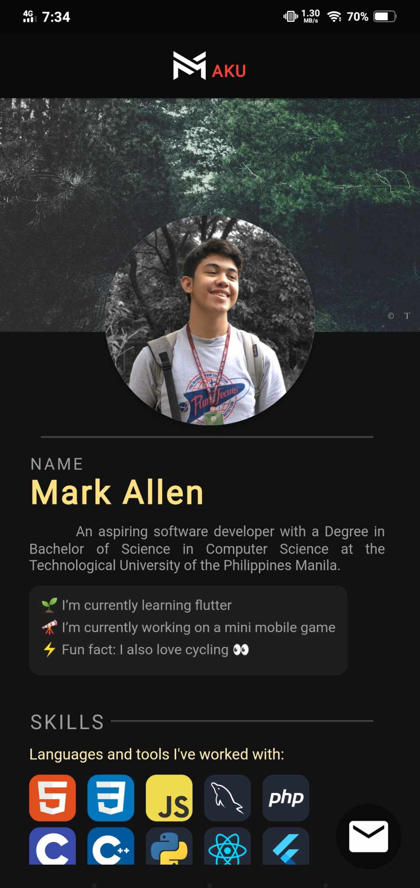
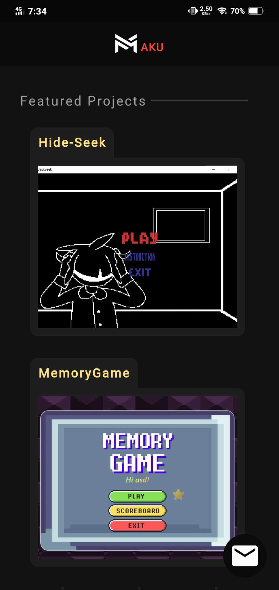
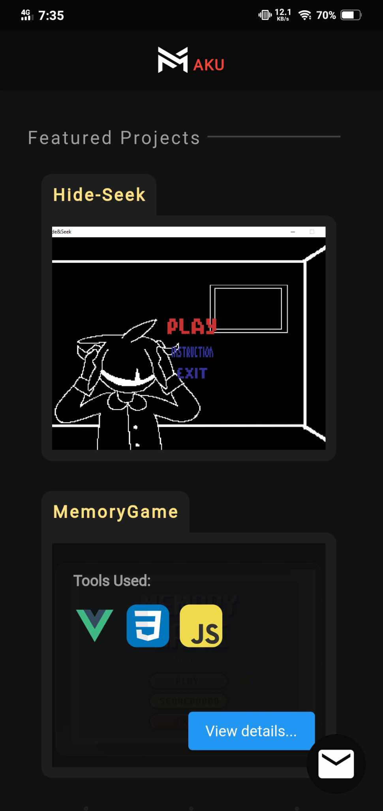
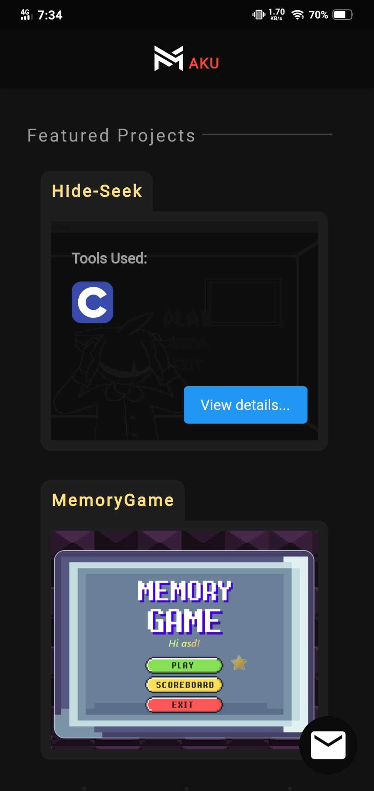
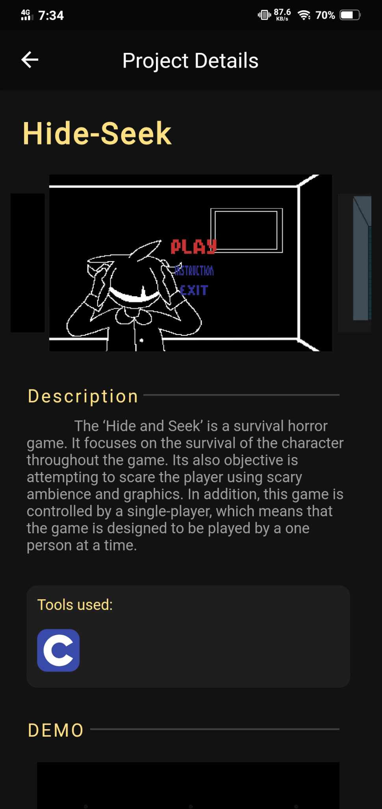
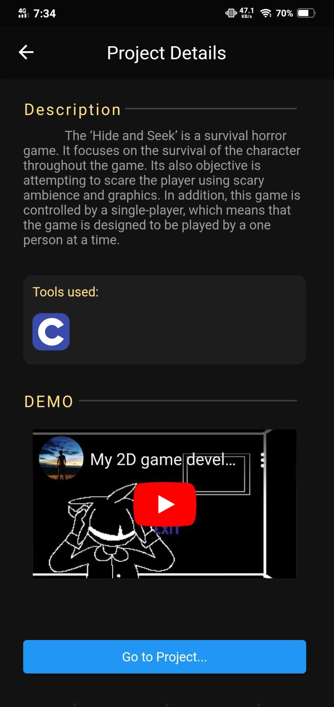

# FlutterPortfolio
This is my Portfolio created in flutter

## Home Screen

This features my introduction and skills

 

Featured Projects: upon selecting a project, it will display the tools used for its development together with buttons that direct the user to a more detailed page.

## Project Details Screen

 

This page displays a more detailed description of the project.

## Contact Screen

Displays some of my information and other socials.

Project video demo -> https://youtube.com/shorts/Hg2qo1HY_0Y?feature=share
APK available at ->
